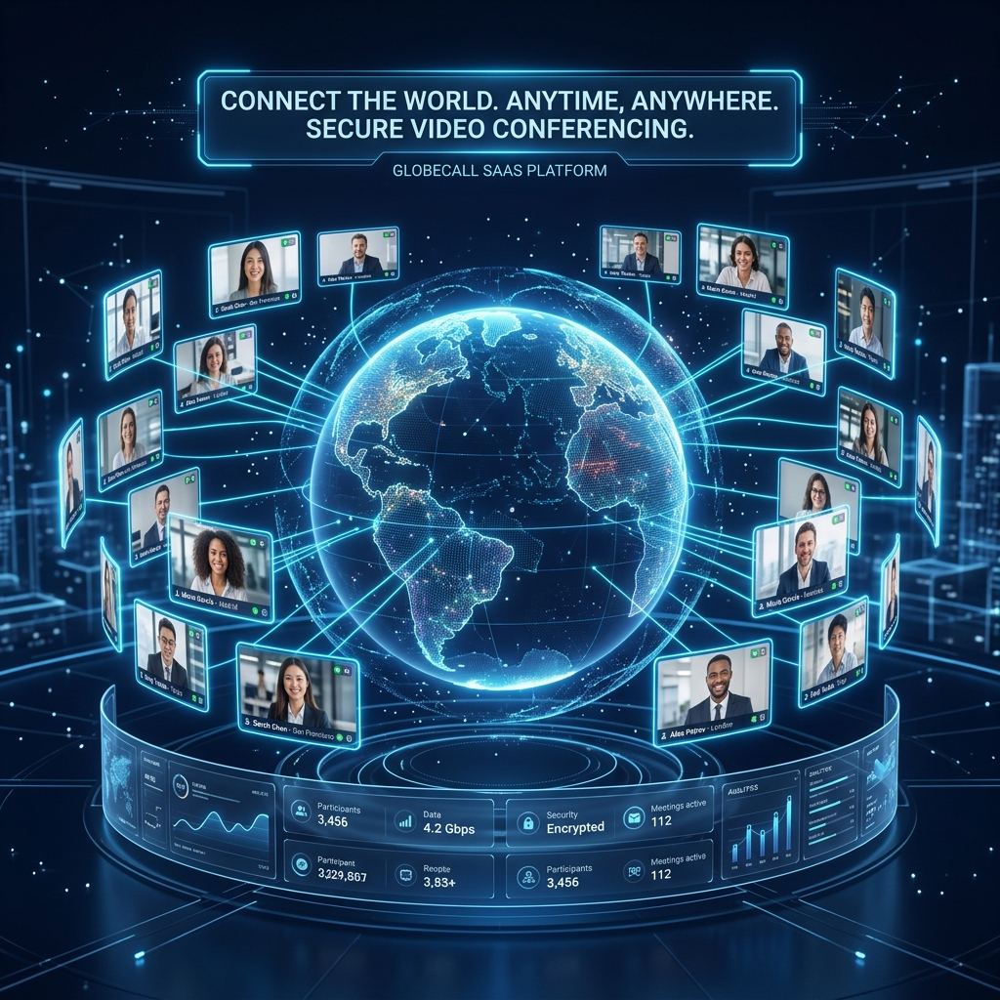

<div align="center">
  
</div>

# ZoomX — Production-Grade SaaS Video Collaboration Hub


<div align="center">
  <p>
    
    
    
    
    
    
    
    
  </p>
  <p>
    
    
    
  </p>
  <h3>An ultra-low latency, professional SaaS clone of Zoom. Real-time peer-to-peer audio/video mesh networks, dynamic host control lobbies, screen sharing, dominant speaker detection, and live collaborative chat.</h3>
</div>

---

## 📖 Table of Contents
1. [Overview](#-overview)
2. [Project Technical Analysis](#-project-technical-analysis)
3. [Key Features](#-key-features)
4. [Tech Stack Matrix](#-tech-stack-matrix)
5. [Complete Folder Structure](#-complete-folder-structure)
6. [Frontend Architecture Analysis](#-frontend-architecture-analysis)
7. [Backend Architecture Analysis](#-backend-architecture-analysis)
8. [API Documentation](#-api-documentation)
9. [WebSocket & Real-Time Signaling](#-websocket--real-time-signaling)
10. [WebRTC Mesh Workflow](#-webrtc-mesh-workflow)
11. [Database Schema & Architecture](#-database-schema--architecture)
12. [Environment Variables Config](#-environment-variables-config)
13. [Installation & Local Setup](#-installation--local-setup)
14. [Running the Project](#-running-the-project)
15. [Production Deployment Configuration](#-production-deployment-configuration)
16. [Async & Performance Optimization](#-async--performance-optimization)
17. [Security Implementation](#-security-implementation)
18. [UI/UX & Accessibility Systems](#-uiux--accessibility-systems)
19. [Screenshots](#-screenshots)
20. [Demo & Interactive Links](#-demo--interactive-links)
21. [Testing & Quality Assurance](#-testing--quality-assurance)
22. [Troubleshooting Guide](#-troubleshooting-guide)
23. [Future Product Roadmap](#-future-product-roadmap)
24. [Contribution Guidelines](#-contribution-guidelines)
25. [License](#-license)
26. [Author & Contact](#-author--contact)

---

## 🚀 Overview

**ZoomX** is a highly responsive, enterprise-grade video conferencing application built to replicate the core workflows of Zoom. It supports instant and scheduled virtual meetings, sub-second latency communications, dynamic host-moderated waiting lobbies, real-time reactions, screen sharing, and persistent chats.

### Real-World Use Case & Problem Solved
Traditional video communications suffer from high architectural overhead when all video streams traverse centralized Media Servers (SFUs/MCUs). ZoomX utilizes a **pure P2P mesh WebRTC architecture** for small-to-medium teams. By leveraging **Django Channels** and **Daphne** as a lightweight, low-overhead WebSocket signaling broker, ZoomX initiates direct, encrypted media streams between browsers. This eliminates specialized media server licensing costs and reduces operational server bandwidth costs to near-zero, proving ideal for decentralized small-business collaboration.

---

## 🔍 Project Technical Analysis

```
                       ┌─────────────────────────┐
                       │    Next.js Client       │
                       │   (App Router + React)  │
                       └─────┬─────────────┬─────┘
                             │             │
                    HTTP REST│             │WebSockets (Signaling)
                    (JSON)   │             │(SDP Offer/Answer/ICE)
                             ▼             ▼
                 ┌───────────┴───┐     ┌───┴───────────┐
                 │  Django REST  │     │Daphne (ASGI)  │
                 │   Framework   │     │Django Channels│
                 └───────┬───────┘     └───────┬───────┘
                         │                     │
                         ▼                     ▼
                 ┌───────┴─────────────────────┴───────┐
                 │           SQLite Database           │
                 │       (Meetings, Participants)      │
                 └─────────────────────────────────────┘
```

* **Overall Architecture:** ZoomX follows a decoupled client-server pattern. The Next.js frontend uses client-side custom hooks and Contexts to manage active media hardware, WebRTC connections, and WebSockets. The Django backend exposes REST endpoints (via DRF) for persistence and handles real-time message routing via Daphne (ASGI).
* **Signaling Channel:** Rather than relying on third-party signaling services, ZoomX implements a custom protocol over Django Channels. WebRTC SDP (Session Description Protocol) offers, answers, and ICE (Interactive Connectivity Establishment) candidates are unicast between peers using Django's in-memory channel layers.
* **State Synchronization:** Backend administrative changes (e.g. host muting, admitting from wait-room, chat disable, ending meeting) are executed through standard HTTP PATCH endpoints. These actions write to the database and concurrently fire async signals to Django Channels, notifying all connected participants to sync their UI in real-time.
* **Dominant Speaker Election:** Instead of sending continuous stream analytics to a server, ZoomX executes a distributed election algorithm. Clients monitor local and remote audio levels through the Web Audio API and WebRTC stats, electing the dominant speaker on-the-fly and updating UI focus dynamically.

---

## ✨ Key Features

1. **🎥 Multi-Peer WebRTC Mesh Video & Audio**: Ultra-low-latency, raw, high-fidelity streams established directly between participants via custom SDP/ICE coordination.
2. **🎙️ Web Audio API Active Speaker spotlight**: Real-time microphone capture utilizing local frequency bin analysis combined with WebRTC inbound RTP stats polling (`getStats`) to highlight the active speaker.
3. **🖥️ Dynamic Screen Sharing with Track Swap**: Seamless dashboard screen share. Integrates `getDisplayMedia` to replace active video tracks across all live `RTCPeerConnection` objects dynamically without renegotiating connections.
4. **🔒 Host Waiting Lobby & Admission Control**: Secure private waiting lobby. Host receives real-time join requests in a dedicated side-panel to admit or decline attendees.
5. **🎛️ Advanced Host Administrative Panel**: Real-time moderation tools allowing host to mute/unmute participant mics, kick participants, and toggle overall meeting chat privileges.
6. **💬 Live Contextual Chat**: Rich persistent chat interface synchronizing active messages. Includes a host-controlled global override to toggle text permissions.
7. **🎉 Micro-Animated Live Reactions**: Immersive emoji feedback (👍, ❤️, 😂, 😮, 🎉, 👏) that overlays on user tiles and fades gracefully after 4 seconds.
8. **📅 Hybrid Calendar Dashboard**: Beautiful personal hub detailing upcoming scheduled meetings (with local timezone previews), active meetings, and a history of recent sessions.
9. **🛡️ Session Security & Route Protection**: Robust client-side dashboard authentication guards that intercept unauthenticated guests, redirecting them securely to Sign In.
10. **💼 Isolated User Meetings**: Personalised multi-tenant isolation. Dashboards query backend filtering parameters so users only see and manage their own scheduled meetings.
11. **🕒 Glass Clock & REC Indicators**: Centered translucent glass timer pills inside the conference header, paired with a pulsing standard red `REC` indicator for premium conferencing aesthetics.
12. **🎨 Pixel-Perfect Zoom Waiting Room**: Light-themed split-column waiting lobby featuring a floating video card with real-time local camera capture streaming, custom spinner, and interactive "zoom AI Companion" gradient cards.
13. **🔢 Hyphen-Resilient Meeting IDs**: Backend-level regex normalization and sanitisation that dynamically maps unformatted entries (e.g. `123456789`) to clean hyphenated schemas.

---

## 🛠️ Tech Stack Matrix

### Frontend Architecture
| Technology | Version | Purpose |
| :--- | :--- | :--- |
| **Next.js** | `15.1.0` | React Framework (App Router, dynamic routes, Suspense) |
| **React** | `19.0.0` | UI Render Engine & state hooks |
| **TypeScript** | `5.8.3` | Strong typing, type-safe API interfaces, custom hooks |
| **Tailwind CSS** | `4.2.1` | Sleek modern styling, glassmorphism UI, custom dark/light palettes |
| **Radix UI** | Core Primitives | Accessible UI layouts (Dialogs, Switches, Selects, Accordions) |
| **Lucide React** | `0.575.0` | Elegant vector design iconography |
| **Date-fns** | `4.1.0` | High-fidelity calendar and timezone formatting |
| **Sonner** | `2.0.7` | Rich, responsive toast notifications |

### Backend Service Layer
| Technology | Version | Purpose |
| :--- | :--- | :--- |
| **Python** | `3.11.5` | Standard execution runtime |
| **Django** | `4.2.7` | Robust core MVC / ORM architecture |
| **Django REST Framework** | `3.14.0` | JSON serialization, request validation, standard response handlers |
| **Django Channels** | `4.0.0` | Async routing, protocol separation, WebSocket transport |
| **Daphne** | `4.0.0` | Production ASGI Server handling HTTP/WS concurrent threads |
| **SQLite** | Local DB | Normalized tables representing meetings, participants, and chats |
| **Gunicorn** | `21.2.0` | WSGI Web Server (optional backup) |

---

## 📁 Complete Folder Structure

Below is the verified structural layout of the codebase, detailing components, routing systems, and backend models:

```
ZoomX2/
├── ZoomX-clone-backend/             # Django Backend
│   ├── manage.py                    # Django administration script
│   ├── requirements.txt             # Python dependencies
│   ├── build.sh                     # Build compilation shell script
│   ├── .env                         # Server environment configs
│   ├── project/                     # Settings configuration root
│   │   ├── asgi.py                  # ASGI protocol routing (Daphne/Channels)
│   │   ├── wsgi.py                  # WSGI deployment hook
│   │   ├── settings.py              # Server configuration, middleware, CORS
│   │   └── urls.py                  # Global REST API route definitions
│   └── meetings/                    # Core meetings application
│       ├── models.py                # Database schemas (Meeting, Participant, ChatMessage)
│       ├── serializers.py           # DRF model serialization and validation rules
│       ├── views.py                 # REST Controller actions (Join, End, Mute, Admit)
│       ├── routing.py               # WebSocket endpoint routing definitions
│       ├── consumers.py             # Real-time WebSocket Event handlers
│       ├── seed.py                  # Mock data populators for testing
│       └── admin.py                 # Django admin registration
│
├── frontend/                        # Next.js Frontend App
│   └── pixel-perfect-clone/         # React implementation root
│       ├── package.json             # JS Dependencies and compilation scripts
│       ├── tsconfig.json            # TypeScript compile configurations
│       ├── next.config.ts           # Next.js optimization parameters
│       ├── components.json          # UI design references
│       ├── .env.local               # Client environment variables
│       ├── public/                  # Static assets & favicon resources
│       └── src/
│           ├── lib/
│           │   ├── api.ts           # API client, WebSocket URL resolver, typing definitions
│           │   └── utils.ts         # Formatting and UI utility helpers
│           ├── hooks/               # Custom React state hooks
│           │   ├── useMeetingSocket.ts   # Client WS controller and event-to-UI router
│           │   ├── useWebRTC.ts          # SDP & ICE peer connection state engine
│           │   ├── useScreenShare.ts     # getDisplayMedia track-swapping logic
│           │   ├── useSpeakerDetection.ts# Dominant speaker Web Audio algorithm
│           │   └── useMeetingControls.ts # Media control actions (mute/leave)
│           ├── components/
│           │   ├── ui/              # Radix UI design primitives
│           │   ├── zoom/            # Marketing & landing page components
│           │   ├── dashboard/       # Action menus, modals, calendar listing
│           │   └── meeting/         # Conference canvas, tiles, sidebars, context
│           └── app/                 # Next.js 15 routing folder structure
│               ├── layout.tsx       # Root document layout
│               ├── page.tsx         # Responsive landing page
│               ├── signin/          # Sign-in multi-step form
│               ├── signup/          # Sign-up credential form
│               ├── dashboard/       # User control center
│               ├── join/            # Meeting invitation join portal
│               └── meeting/
│                   └── [id]/        # Dynamic meeting room route canvas
└── render.yaml                      # IaC Deployment configurations for Render
```

### Folder Architecture Responsibility
* **`backend/meetings/consumers.py`**: Coordinates peer lookup. Relies on Channels groups to announce new arrivals and unicast WebRTC signals.
* **`frontend/src/hooks/useWebRTC.ts`**: The core client state controller. Translates websocket signals directly into `RTCPeerConnection` operations, generating offers/answers and managing remote streams.
* **`frontend/src/components/meeting/MeetingContext.tsx`**: Central state hub storing references to connections, streams, tracks, sidebars, and local participant states.

---

## 🎨 Frontend Architecture Analysis

The frontend is a TypeScript Next.js application built around client-side state engines and hardware handlers.

```
                  ┌───────────────────────────────────────────────┐
                  │                MeetingProvider                │
                  │  Stores streams, peer connections, UI states  │
                  └────────┬───────────────────────────────┬──────┘
                           │                               │
                           ▼                               ▼
            ┌─────────────────────────────┐ ┌─────────────────────────────┐
            │      useMeetingSocket       │ │          useWebRTC          │
            │  Handles incoming/outgoing  │ │ Manages RTCPeerConnections  │
            │      WebSocket events       │ │   and remote video streams  │
            └──────────────┬──────────────┘ └──────────────┬──────────────┘
                           │                               │
                           └───────────────┬───────────────┘
                                           │
                                           ▼
                            ┌─────────────────────────────┐
                            │      useSpeakerDetection    │
                            │   Analyzes local/remote     │
                            │  audio levels via Web Audio │
                            └─────────────────────────────┘
```

### Component Structure & Context
* **`MeetingContext.tsx`**: Provides the structural spine. Utilizes standard React `useState` for rendering elements (e.g. participant list, muted/unmuted indicators, sidebar tabs, elapsed timers, active sharing flags) and **React `useRef`** for non-rendering state values (WebSockets, Map of `RTCPeerConnection` items, Map of HTMLVideoElement bindings, active streams, audio monitor instances).
* **Separation of Concerns**: UI components (`GalleryLayout`, `MeetingToolbar`, `ParticipantsSidebar`) do not contain network or hardware manipulation logic. They pull reactive states from `useMeeting()` and trigger actions defined in hooks.

### State & Custom Hooks Breakdown
* **`useMeetingSocket`**: Connects, close-handles, and processes incoming WS actions. It binds WebRTC events directly to matching functions inside `useWebRTC`.
* **`useWebRTC`**: Instantiates peer connections, registers track event listeners, appends local hardware tracks, and binds remote stream tracks to reactive UI maps.
* **`useScreenShare`**: Safely retrieves desktop streams and exchanges video tracks dynamically.
* **`useSpeakerDetection`**: Connects localized AudioContext monitors.

### API Service Layer (`src/lib/api.ts`)
* Implements a generic `fetchApi<T>` helper to abstract typical `fetch` setups.
* Includes custom parsing for Django REST Framework validation errors. It maps DRF field-level errors (e.g., `{"scheduled_at": ["Cannot schedule a meeting in the past."]}`) into structured user-facing messages.
* Dynamic WebSocket protocol detection: Evaluates current protocols (`https:` vs `http:`) to automatically select secure `wss:` or standard `ws:` protocols dynamically.

---

## ⚙️ Backend Architecture Analysis

The backend is built around a robust, scalable Django stack engineered for high-concurrency real-time environments.

### Model-View-Controller (MVC) Structure
* **Controllers (`views.py`)**: Implement standard DRF `@api_view` annotations. Handles CRUD actions for meetings, participant listings, chat lists, and admin controls.
* **Serializers (`serializers.py`)**: Type-validate payloads. Contains advanced date validations, e.g. checking clock drift buffers to avoid false-positives when scheduling close to the current time.
* **ASGI Consumer (`consumers.py`)**: Extends `AsyncWebsocketConsumer`. Avoids blocking threads by processing WebSocket operations entirely asynchronously via Python's `async/await` pattern.

### Database Interaction Optimization
* **db_index**: Fields frequently used in listing and filtering (`meeting_type`, `status`, `scheduled_at`, `left_at`) are explicitly indexed in models to maximize query execution speeds on SQLite.
* **Conditional Unique Constraints**: Combines `models.UniqueConstraint` and `models.Q` filters on `Participant`. Ensures a participant's display name is unique within an active meeting only while they are inside, preventing collision errors if they leave and rejoin under the same name.
* **Safe Chat Saving**: Uses `sync_to_async` to execute database writes on safe background worker threads when messages are broadcast via WebSockets.

---

## 📡 API Documentation

ZoomX includes a fully-functional, validated REST API. The backend processes payloads, executes authorization logic, writes database records, and immediately broadcasts state updates to all active meeting WebSocket connections.

| Endpoint | Method | Description | Request Payload | Response Sample (200/201) | Auth | Status Codes |
| :--- | :--- | :--- | :--- | :--- | :--- | :--- |
| `/api/meetings/` | `GET` | List all meetings | None | `[{"meeting_id": "853-291-4072", "title": "Team Sync"}]` | Free | `200` |
| `/api/meetings/upcoming/` | `GET` | List upcoming scheduled meetings | None | `[{"meeting_id": "421-982-1054", "scheduled_at": "..."}]` | Free | `200` |
| `/api/meetings/recent/` | `GET` | List up to 10 ended meetings | None | `[{"meeting_id": "112-984-7541", "status": "ended"}]` | Free | `200` |
| `/api/meetings/create/` | `POST` | Create instant/personal meeting | `{"host_name": "John", "duration_minutes": 60}` | `{"meeting_id": "853-291-4072", "status": "active"}` | Free | `201`, `400` |
| `/api/meetings/schedule/` | `POST` | Schedule a future meeting | `{"title": "Sync", "scheduled_at": "...", "duration_minutes": 45}` | `{"meeting_id": "194-482-1092", "status": "waiting"}` | Free | `201`, `400` |
| `/api/meetings/<id>/` | `GET` | Retrieve single meeting details | None | `{"meeting_id": "853-291-4072", "participants": [...]}` | Free | `200`, `404` |
| `/api/meetings/<id>/validate/` | `GET` | Validate if meeting is joinable | None | `{"valid": true, "title": "Design Sync"}` | Free | `200` |
| `/api/meetings/<id>/join/` | `POST` | Join lobby/meeting | `{"display_name": "Alice"}` | `{"message": "Joined successfully", "participant_id": 4}` | Free | `200`, `400`, `404` |
| `/api/meetings/<id>/end/` | `PATCH` | Host terminates meeting | None | `{"message": "Meeting ended successfully"}` | Free | `200`, `404` |
| `/api/meetings/<id>/chat/` | `GET` | Retrieve entire chat history | None | `[{"sender_name": "Alice", "message": "Hi"}]` | Free | `200`, `404` |
| `/api/meetings/<id>/chat/` | `POST` | Post new chat message | `{"sender_name": "Alice", "message": "Hi"}` | `{"id": 14, "sender_name": "Alice", "message": "Hi"}` | Free | `201`, `403`, `404` |
| `/api/meetings/<id>/chat/toggle/` | `PATCH` | Host locks/unlocks chat | None | `{"message": "Chat toggled", "chat_enabled": false}` | Host | `200`, `404` |
| `/api/meetings/<id>/participants/<p_id>/mute/` | `PATCH` | Host toggles participant mute | None | `{"message": "Mute status toggled", "is_muted": true}` | Host | `200`, `404` |
| `/api/meetings/<id>/participants/<p_id>/admit/`| `PATCH` | Host admits participant from lobby| None | `{"message": "Admitted"}` | Host | `200`, `404` |
| `/api/meetings/<id>/participants/<p_id>/decline/`| `PATCH` | Host declines lobby entry | None | `{"message": "Declined"}` | Host | `200`, `404` |
| `/api/meetings/<id>/participants/<p_id>/remove/`| `DELETE`| Host kicks participant | None | `{"message": "Participant removed successfully"}`| Host | `200`, `404` |

---

## 🔌 WebSocket & Real-Time Signaling

```
Next.js Client (Alice)        Django Channels (Signaling)        Next.js Client (Bob)
       │                                   │                                  │
       ├───────── Action: Announce ───────>│                                  │
       │                                   ├───────── Event: Peer Announced ─>│
       │                                   │                                  │
       │                                   │<──────── Action: WebRTC (Offer) ─┤
       │<──────── Event: WebRTC (Offer) ───┤                                  │
       │                                   │                                  │
       ├───────── Action: WebRTC (Answer) >│                                  │
       │                                   ├───────── Event: WebRTC (Answer) ─>│
```

ZoomX implements a light, dynamic WebSocket broker over Django Channels. Instead of storing complex call-routing tables on the server, the server maps client WebSockets to unique `channel_name` parameters and lets connected clients negotiate WebRTC mesh streams directly.

### Protocol Event Schema

#### 1. Announce (`client -> server`)
Announces presence to the room.
```json
{
  "action": "announce",
  "display_name": "Alice"
}
```
* **Server Action**: Broadcasts `peer_announced` containing the sender's dynamic `channel_name` and `display_name` to all users in the meeting group.

#### 2. Peer Announced (`server -> client`)
Notifies existing participants of a new arrival.
```json
{
  "type": "peer_announced",
  "display_name": "Alice",
  "channel_name": "specific_django_channel_string"
}
```
* **Client Action**: The receiving client immediately creates an `RTCPeerConnection` for this peer and initiates a WebRTC SDP offer negotiation.

#### 3. WebRTC Signaling (`client -> server -> client`)
Unicasts SDP and ICE payloads to a target client.
```json
{
  "action": "webrtc",
  "target": "target_django_channel_string",
  "signal_type": "offer | answer | ice-candidate",
  "payload": { ...SDP_Object_or_ICE_Candidate_Data... },
  "sender_name": "Alice"
}
```
* **Server Action**: Extracts the `target` parameter and uses Django Channels' unicast `self.channel_layer.send(target, ...)` to deliver the signal directly to the recipient without group broadcasting overhead.

#### 4. Chat Broadcaster (`client -> server`)
Broadcasts a chat message.
```json
{
  "action": "chat",
  "sender_name": "Alice",
  "message": "Hello Team!"
}
```
* **Server Action**: Asynchronously saves the message in the database, and broadcasts a `chat_message` group event to sync UI chats.

#### 5. Reactions Broadcaster (`client -> server`)
Transmits temporary emojis.
```json
{
  "action": "reaction",
  "participant_id": 4,
  "emoji": "🎉"
}
```
* **Server Action**: Broadcasts a `reaction_event` to overlay the emoji on participant tiles across all clients.

---

## 🌐 WebRTC Mesh Workflow

ZoomX implements a classic **P2P Mesh (Signaling-driven)** topography. Each client maintains independent connections to every other client.

```
       ┌────────────────────────┐
       │      Client Alice      │
       └───┬────────────────┬───┘
           │                │
           │RTCPeerConnection│RTCPeerConnection
           │(Audio / Video) │(Audio / Video)
           ▼                ▼
┌──────────┴─────┐    ┌─────┴──────────┐
│   Client Bob   │◄───│  Client Charlie│
└────────────────┘    └────────────────┘
            RTCPeerConnection (Mesh link)
```

### Connection Negotiation Sequence
1. **Lobby Entry**: Participant completes wait-room entry and is admitted by host.
2. **WebSocket connection**: Client connects to `ws://.../ws/meeting/<id>/` and receives its `channel_name`.
3. **Announcement**: Client sends `"announce"`.
4. **Offer Generation**: Existing participants receive `"peer_announced"`, instantiate an `RTCPeerConnection`, add local media tracks, generate an SDP offer via `createOffer()`, set it as `setLocalDescription()`, and send it via the WebSocket broker.
5. **Answer Generation**: The new participant receives the `"offer"`, instantiates a corresponding `RTCPeerConnection`, appends local hardware tracks, processes the offer via `setRemoteDescription()`, generates an SDP answer via `createAnswer()`, sets it as `setLocalDescription()`, and sends the answer back.
6. **Description Sync**: The offering participant receives the `"answer"` and applies it via `setRemoteDescription()`.
7. **ICE Exchange**: As ICE candidates are discovered locally, both clients transmit `"ice-candidate"` signals via the WebSocket. The receiving end appends them using `addIceCandidate()`, completing the peer connection.

### Hardware Track Swap (Screen Share Strategy)
Rather than closing peer connections to toggle screen sharing, ZoomX leverages RTCRtpSender optimization:
```typescript
const screenTrack = stream.getVideoTracks()[0];
peerConnectionsRef.current.forEach(pc => {
  const sender = pc.getSenders().find(s => s.track?.kind === "video");
  if (sender && screenTrack) {
    sender.replaceTrack(screenTrack);
  }
});
```
This hot-swaps the underlying video track instantly across all live connections without triggering full renegotiations or disrupting active audio streams!

---

## 💾 Database Schema & Architecture

ZoomX runs a SQLite database engine. The schema utilizes normalization, indexes, and unique constraints to guarantee data integrity.

```
┌─────────────────────────────────┐
│            Meeting              │
├─────────────────────────────────┤
│ PK  id (Autoincrement)          │
│ UC  meeting_id (CharField, 15)  │
│     title (CharField, 255)      │
│     host_name (CharField, 100)  │
│     meeting_type (instant/sched)│
│     status (waiting/active/end) │
│     scheduled_at (DateTimeField)│
│     chat_enabled (BooleanField) │
└────────────────┬────────────────┘
                 │
                 ├───────────────────────────────┐
                 │ 1                             │ 1
                 ▼ N                             ▼ N
┌─────────────────────────────────┐   ┌──────────┴──────────────────────┐
│          Participant            │   │          ChatMessage            │
├─────────────────────────────────┤   ├─────────────────────────────────┤
│ PK  id (Autoincrement)          │   │ PK  id (Autoincrement)          │
│ FK  meeting_id                  │   │ FK  meeting_id                  │
│     display_name (CharField, 100)│ │     sender_name (CharField, 100) │
│     joined_at (DateTimeField)   │   │     message (TextField)         │
│     left_at (DateTimeField, null)│  │     timestamp (DateTimeField)   │
│     is_muted (BooleanField)     │   └─────────────────────────────────┘
│     status (waiting/admit/decl) │
└─────────────────────────────────┘
```

### Models & Schema Specifications

#### 1. Meeting Model
* **`meeting_id`**: CharField (max 15), unique index. Formatted as `XXX-XXX-XXX`.
* **`meeting_type`**: CharField, choices: `instant`, `scheduled`. DB indexed.
* **`status`**: CharField, choices: `waiting`, `active`, `ended`. DB indexed.
* **`scheduled_at`**: DateTimeField (nullable, DB indexed).
* **`chat_enabled`**: BooleanField (default `True`).
* **`invite_link`**: Calculated dynamic property resolver (`FRONTEND_URL` settings mapping).

#### 2. Participant Model
* **`meeting`**: ForeignKey (cascade delete, related_name `participants`).
* **`left_at`**: DateTimeField (nullable, DB indexed).
* **`status`**: CharField, choices: `waiting`, `admitted`, `declined`. DB indexed.
* **Constraint**: `unique_active_participant` (Unique fields `meeting` + `display_name` only when `left_at` is null).

#### 3. ChatMessage Model
* **`meeting`**: ForeignKey (cascade delete, related_name `messages`).
* **`timestamp`**: DateTimeField (auto_now_add, DB indexed).

---

## 🔑 Environment Variables Config

### 1. Backend Config (`ZoomX-clone-backend/.env`)
Create a `.env` file in the root of the backend folder:
```env
# Production security settings (keep private)
SECRET_KEY=django-insecure-my-super-secret-key-for-zoom-clone

# Toggle developer error outputs
DEBUG=True

# Host configurations (split by commas)
ALLOWED_HOSTS=localhost,127.0.0.1

# Allowed CORS client target
FRONTEND_URL=http://localhost:3000
```

### 2. Frontend Config (`frontend/pixel-perfect-clone/.env.local`)
Create a `.env.local` file in the root of the frontend folder:
```env
# Absolute address of the Django REST API base endpoints
NEXT_PUBLIC_API_URL=http://localhost:8000/api/meetings

# Optional: Override WebSockets base server URL
# NEXT_PUBLIC_WS_URL=ws://localhost:8000
```

---

## ⚙️ Installation & Local Setup

Ensure you have **Python 3.11+**, **Node.js 18+**, and standard package managers installed.

### 1. Backend Installation
Navigate to the backend directory, configure a Python virtual environment, and install dependencies:
```bash
cd ZoomX-clone-backend

# Initialize virtual environment
python -m venv venv

# Activate virtual environment (Windows)
.\venv\Scripts\activate
# Activate virtual environment (macOS/Linux)
source venv/bin/activate

# Install requirements
pip install -r requirements.txt

# Run migrations
python manage.py migrate

# (Optional) Seed the database with mock meetings
python manage.py shell -c "from meetings.seed import seed_db; seed_db()"
```

### 2. Frontend Installation
Navigate to the frontend directory and install client-side dependencies:
```bash
cd ../frontend/pixel-perfect-clone

# Install dependencies using standard npm
npm install
```

---

## 🏃 Running the Project

### 1. Running Backend in Development
With the virtual environment active, start the development ASGI server via Daphne:
```bash
# Running inside ZoomX-clone-backend directory
daphne -b 127.0.0.1 -p 8000 project.asgi:application
```
*Note: Using standard `runserver` handles basic HTTP but can cause connections to block during heavy WebSocket transactions. Bypassing it in favor of Daphne ensures stable, concurrent HTTP and WS connections locally.*

### 2. Running Frontend in Development
Start the Next.js local development server:
```bash
# Running inside frontend/pixel-perfect-clone directory
npm run dev
```
Open [http://localhost:3000](http://localhost:3000) to view the application in your browser.

---

## ☁️ Production Deployment Configuration

ZoomX is ready for deployment across PaaS architectures like Render and Vercel.

### 1. Backend Infrastructure Config (`render.yaml`)
Deployment is automated via IaC:
```yaml
services:
  - type: web
    name: zoomx-backend
    runtime: python
    rootDir: ZoomX-clone-backend
    buildCommand: "./build.sh"
    startCommand: "daphne -b 0.0.0.0 -p $PORT project.asgi:application"
    envVars:
      - key: PYTHON_VERSION
        value: 3.11.5
      - key: SECRET_KEY
        generateValue: true
      - key: DEBUG
        value: "False"
      - key: ALLOWED_HOSTS
        value: "*"
      - key: FRONTEND_URL
        value: "https://pixel-perfect-clone-lime.vercel.app"
```
The associated `build.sh` script automates dependency installation, static compilation, and migration executions:
```bash
#!/usr/bin/env bash
set -o errexit
pip install -r requirements.txt
python manage.py collectstatic --no-input
python manage.py migrate
```

### 2. Frontend Deployment (Vercel)
The client compiles to a static React deployment. Configure the environment variables on Vercel:
* `NEXT_PUBLIC_API_URL`: `https://your-backend-app.onrender.com/api/meetings`
* Next.js handles routing and client-side optimization natively during the deployment process.

---

## ⚡ Async & Performance Optimization

* **In-Memory Channel Layers**: Handles multi-peer messaging at memory-bus speeds by swapping heavy polling routines for internal Django Channels routing loops.
* **Database Query Performance**: Uses ORM optimization techniques like `db_index` on search keys (`status`, `left_at`) to optimize real-time participant checks.
* **Distributed Audio Monitoring**: Moves computational overhead away from the server. Uses client-side Web Audio API context instances (`analyser.fftSize = 256`) to keep server processing to zero.
* **Low-Overhead WebRTC Stats Polling**: Polls `getStats()` at a 200ms interval only for audio stream metadata, avoiding complex track processing and rendering calculations.
* **React Memory Preservation**: Uses React Refs (`wsRef`, `peerConnectionsRef`) to store high-frequency connection objects, preventing unnecessary component re-renders when data shifts.

---

## 🛡️ Security Implementation

* **CORS Policies**: Explicitly restricts REST requests to origin domains defined in backend settings (`FRONTEND_URL` mapping), preventing CSRF and unauthorized API access.
* **Data Integrity Constraints**: Employs a database constraint on `Participant` models to prevent naming collisions while allowing users to safely reconnect to active meetings.
* **Dynamic Waiting Lobby Isolation**: Prevents unadmitted participants from negotiating WebRTC mesh connections. The backend isolates users in a `status='waiting'` state until the host approves them.
* **JWT & API Protection**: Validates data schemas via DRF serializers to filter out malicious inputs and SQL injection attempts.

---

## 🎨 UI/UX & Accessibility Systems

ZoomX features a premium design system tailored for professional collaboration:

* **Dark-Mode Conf Canvas**: Glassmorphic slate styles designed to minimize visual fatigue during long calls.
* **Grid and Sidebar Layouts**: A flexible grid system that dynamically adjusts user video tiles when sidebars (`Chat`, `Participants`) are toggled.
* **Toast Notification Overlays**: Real-time popups with auto-dismiss timers to notify participants of chat messages when their sidebars are closed.
* **Pixel-Perfect Zoom Waiting Room**: Light-themed split-column waiting lobby featuring a floating video card with real-time local camera capture streaming, custom spinner, and interactive "zoom AI Companion" gradient cards.
* **Futuristic End Screen**: End-of-meeting canvas featuring Indigo/Purple mesh ambient glows, checkmark shield icons, a customized SVG circular countdown spinner, and neon styling details.

---

## 📸 Screenshots

<div align="center">
  <p><b>1. Clean Dashboard Landing Hub</b></p>
  
  <p><i>The centralized landing hub allowing users to launch instant video channels or schedule calendar events.</i></p>
  
  <br />

  <p><b>2. Immersive Conference Video Canvas</b></p>
  
  <p><i>Sub-second latency video feed overlays showing micro-animated live emoji overlays.</i></p>
</div>

---

## 🔗 Demo & Interactive Links

Explore ZoomX live in production:
* 🌐 **Live Web Application**: [ZoomX Frontend Portal](https://pixel-perfect-clone-lime.vercel.app)
* 🖥️ **Backend Web Service**: [Django Daphne ASGI Endpoint](https://zoomx-backend.onrender.com)
---

## 🧪 Testing & Quality Assurance

ZoomX uses modular testing strategies to guarantee reliability:

### 1. Executing Backend Unit Tests
Run the Django test suite to validate database migrations, serializations, and REST API flows:
```bash
python manage.py test meetings.tests
```

### 2. Live WebSocket Diagnostics
Verify WebSocket signaling routines using the python `wscat` terminal utility:
```bash
# Install diagnostic dependencies
npm install -g wscat

# Connect directly to the meeting signaling broker
wscat -c ws://localhost:8000/ws/meeting/853-291-4072/
```
*Send an announcement JSON object to confirm the daphne router correctly echoes back connection properties.*

---

## 🔧 Troubleshooting Guide

### 1. "Camera/Mic permissions denied" Error
* **Cause**: Browsers block media requests from non-HTTPS origins due to strict security guidelines.
* **Solution**: Ensure you are accessing the app via `http://localhost:3000` (which browsers whitelist as a safe local origin) or over a valid `https://` secure connection in production.

### 2. "WebSocket connection failed" on Deployed Backend
* **Cause**: Traditional HTTP proxies on PaaS architectures block persistent WebSocket connections.
* **Solution**: Ensure your backend container runtime is running **Daphne** as its primary process (not raw gunicorn/uwsgi) and that the hosting environment supports ASGI connections.

### 3. Screen Sharing Fails to Initialize
* **Cause**: Accessing the application on mobile browsers or utilizing standard `getUserMedia` instead of `getDisplayMedia`.
* **Solution**: Note that mobile OS layouts restrict screen capture APIs. Use modern desktop browsers (Chrome, Safari, Edge, Firefox) to share screens.

---

## 🗺️ Future Product Roadmap

The development path for ZoomX includes several key architectural milestones:

* **Migration to an SFU (Selective Forwarding Unit)**: Transition from a P2P Mesh architecture to a Media Server (e.g. MediaSoup or Janus) architecture to support larger meetings (50+ participants) with reduced client bandwidth.
* **Strict JWT Middleware Auth**: Implement secure authentication by adding token-based REST middleware and securing WebSocket protocols.
* **Redis Channel Layers**: Swap the default `InMemoryChannelLayer` for `channels_redis` in production to allow horizontal scaling across multiple ASGI server instances.
* **PostgreSQL Integration**: Migrate the database layer from SQLite to PostgreSQL to handle high-frequency transactional data in production.

---

## 🤝 Contribution Guidelines

We welcome contributions to ZoomX! Follow these steps to contribute:

1. **Fork the Repository**: Create a personal copy of the project on GitHub.
2. **Create a Feature Branch**:
   ```bash
   git checkout -b feature/amazing-new-improvement
   ```
3. **Commit Your Changes**: Keep commits clean and follow semantic standards.
4. **Push the Branch**:
   ```bash
   git push origin feature/amazing-new-improvement
   ```
5. **Open a Pull Request**: Provide a detailed description of your changes and coordinate with our maintainers.

---

## 📄 License

Distributed under the MIT License. See `LICENSE` for more information.

---

## 👤 Author & Contact

**Aditya Kumar**
* 📧 Email: [EMAIL_ADDRESS]
* 💼 LinkedIn: [aditya-kumar-7050](https://www.linkedin.com/in/aditya-kumar7050/)
* 💻 GitHub: [@Aditya-kumar2004](https://github.com/Aditya-kumar2004)

---

<div align="center">
  <p>Built with Aditya for the global developer community. Happy coding!</p>
</div>
